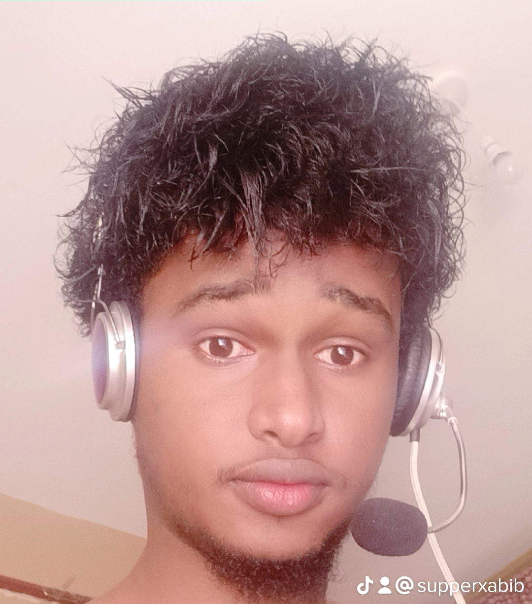

<h1 align="center">Hi there, I'm ABIB AHMED 👋</h1>

<h3 align="center">🚀 Full-Stack Developer | 🤖 AI/ML Enthusiast | 🎨 UI/UX Designer</h3>

  

  
  
  
  
  

---

### **🌟 About Me**

- 🚀 I'm a passionate **Full-Stack Developer** with expertise in both frontend and backend technologies.
- 🤖 **AI/ML Enthusiast** – Passionate about machine learning, neural networks, and intelligent applications.
- 🎨 Combining **UI/UX design skills** with **full-stack development** and **AI integration** to create innovative solutions.
- 🖥️ I specialize in **modern web applications**, **scalable architectures**, and **AI-powered interfaces**.
- 🧩 Focus on crafting **end-to-end solutions** with clean code, intuitive UX, and intelligent features.
- 🌍 Open to collaborations in full-stack development and AI/ML projects!

---

### **🛠️ Technical Stack**

#### **🌐 Frontend Development**
- **Languages:** HTML, CSS, JavaScript, TypeScript  
- **Frameworks & Libraries:** React.js, Next.js, Vue.js, Angular
- **Styling:** Tailwind CSS, SCSS, Styled Components, Material-UI
- **State Management:** Redux, Zustand, Context API
- **Performance:** Webpack, Vite, Lighthouse Optimization

#### **⚙️ Backend Development**
- **Runtime:** Node.js, Deno, Python
- **Frameworks:** Express.js, NestJS, Fastify, Django, Flask
- **Databases:** MongoDB, PostgreSQL, MySQL, Firebase, Redis
- **APIs:** RESTful APIs, GraphQL, WebSocket, Server-Sent Events
- **Authentication:** JWT, OAuth, Passport.js, Session Management

#### **🤖 AI/ML & Data Science**
- **Machine Learning:** Scikit-learn, TensorFlow, PyTorch, Keras
- **Data Processing:** Pandas, NumPy, Matplotlib, Seaborn
- **Natural Language Processing:** NLTK, spaCy, Transformers
- **Computer Vision:** OpenCV, YOLO, CNN Architectures
- **AI Integration:** API-based AI services, Custom ML models

#### **🎨 UI/UX Design**
- **Design Tools:** Figma, Adobe XD, Sketch, Adobe Creative Suite
- **Prototyping & Wireframing:** Figma, Balsamiq, InVision  
- **Design Principles:** User-Centered Design, Accessibility, Design Systems
- **Motion Design:** Lottie, Framer Motion, CSS Animations

#### **🛠️ DevOps & Tools**
- **Version Control:** Git, GitHub, GitLab, Bitbucket
- **CI/CD:** GitHub Actions, Jenkins, Docker, Kubernetes
- **Testing:** Jest, React Testing Library, Cypress, Mocha, Pytest
- **Cloud Services:** AWS, GCP, Azure, Vercel, Netlify, Heroku
- **Package Managers:** npm, yarn, pnpm, pip, conda

---

### **📂 Featured Projects**

🌟 Check out some of my best work:  

1. 🛒 **https://github.com/fdesdsf/E-commerce** – Full-featured e-commerce platform with recommendation system and AI-powered search.  
2. 🏥 **https://github.com/fdesdsf/Hospital** – Healthcare management system with predictive analytics and patient monitoring features.  
3. 🎮 **https://github.com/fdesdsf/Rock-Paper-and-Scissor-Game** – Interactive game with AI opponent using machine learning algorithms.

📺 **Explore More:** [My Portfolio](https://abib-ahmed-portfolio.onrender.com) | [Live Demos](#) | [AI/ML Experiments](#)

---

### **📢 Connect With Me**

  
  
  
  
  

---

### **💡 Fun Facts & Philosophy**

- 🤖 **AI Enthusiast** – Constantly exploring new ML models and neural network architectures
- 🔄 **"From Design to Deployment to Intelligence"** – I enjoy building complete solutions with AI integration
- 🎵 Music fuels my coding sessions, especially when working on complex AI algorithms
- 🏆 Passionate about solving real-world problems with full-stack development and machine learning
- 📚 Currently diving deep into deep learning, NLP, and AI ethics

---

### **🚀 Current Focus**

- 🔭 Working on **AI-powered web applications** and intelligent automation systems
- 🌱 Learning **advanced ML algorithms**, **deep learning architectures**, and **MLOps**
- 🤝 Looking to collaborate on **AI integration projects** and **full-stack solutions with ML components**
- 💬 Ask me about **JavaScript, React, Node.js, Python ML libraries, or AI/UX convergence**
- 📫 How to reach me: xabiiib0790@gmail.com
- ⚡ **AI Vision:** Exploring how machine learning can enhance user experiences and create smarter applications

---

### **🔬 AI/ML Interests**

- Machine Learning Model Development & Deployment
- Neural Networks & Deep Learning
- Natural Language Processing (NLP)
- Computer Vision Applications
- AI Integration in Web Applications
- Data Analysis & Visualization
- Ethical AI & Responsible Machine Learning

---

🚀 **Let's Build Intelligent Full-Stack Solutions Together!** 🚀
